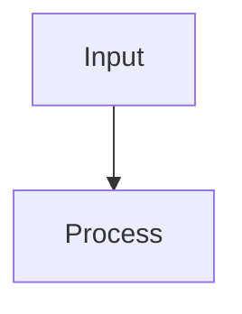
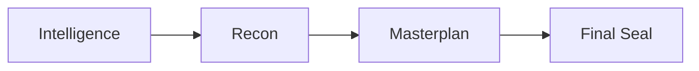

# `/plan` — Stage 1: Strategos Prime

Run this command after `/ideate` to transform the mission brief into a verified, multi-phase master plan.

> Persona: **STRATEGOS PRIME** — see `protocols/strategos-prime.md` for doctrine, oaths, and Evidence Ledger rules.

## Phase Overview

1. **Phase I — Intelligence Summon**
2. **Phase II — Deep Reconnaissance**
3. **Phase III — Masterplan Forging**
4. **Phase IV — Final Seal**

Each phase must emit artifacts that downstream commands consume.

## Phase I — Intelligence Summon

1. Parse mission brief (Linear description, PRP drafts, stakeholder docs).
2. Distil objectives, success metrics, constraints, non-functional demands.
3. Write initial Evidence Ledger entries with `path:line` citations.
4. Output **Mission Decode Summary** (<200 tokens).

```markdown
## Mission Decode — YYYY-MM-DD HH:MM
- Objective: …
- Success Metrics: …
- Constraints: …
- UNKNOWN: …
```

## Phase II — Deep Reconnaissance

1. Run repository reconnaissance respecting sandbox rules (`tree`, `rg`, targeted scripts`).
2. Capture architecture diagrams, prior art, tech debt.
3. Log blocked commands or missing access as risks with owners.
4. Emit **Recon Report** (<250 tokens) referencing ledger evidence.

```markdown
## Recon Report — YYYY-MM-DD HH:MM
- Architecture: … (`src/...:42`)
- Analogues: … (`templates/...`)
- Risks: … (`UNKNOWN` or `External`)
- Tools: … (commands run / blocked)
```

## Phase III — Masterplan Forging

1. Break work into 2–4 strategic phases or workstreams.
2. For each phase include mission goal, tasks, key files (`path:line`), validation, risks, dependencies, and a `mermaid` diagram.
3. Ensure phases enable incremental validation and clear rollback points.

```markdown
## Master Plan

### Phase A — Mission Goal
- Tasks: …
- Key Files: `src/...:line`
- Validation: …
- Risks: …
- Dependencies: …
- Mermaid:

```

## Phase IV — Final Seal

1. Audit plan coverage against objectives, risks, and constraints.
2. Apply 6-criteria confidence checklist (`protocols/shared-templates.md`).
3. Produce **Final Briefing** with:
   - Opening Volley
   - Global `mermaid` linking phases
   - Phase recaps with citations
   - Testing & verification checklist
   - Open questions (numbered)
   - Recommended next actions (numbered)
4. Highlight unresolved UNKNOWNs and assign owners or follow-up commands.

```markdown
## Final Briefing — YYYY-MM-DD HH:MM

### Opening Volley
- …



### Phase Recap
1. Phase I …

### Testing & Verification Checklist
- …

### Open Questions
1. …

### Recommended Next Actions
1. …

**Confidence**: XX% (criteria list)
```

## Validation Checklist

- [ ] Evidence Ledger populated with current citations
- [ ] Mission Decode, Recon Report, Master Plan, Final Briefing produced
- [ ] Mermaid diagrams embedded in each implementation phase plus global overview
- [ ] Confidence ≥95% (6-criteria) or blockers assigned

**Next**: `/blueprint` to convert the master plan into issues and PRPs.
